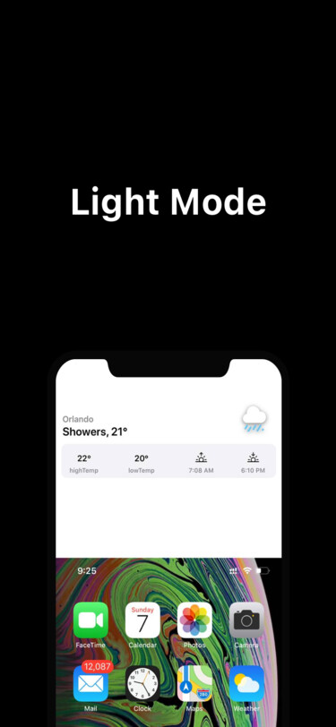
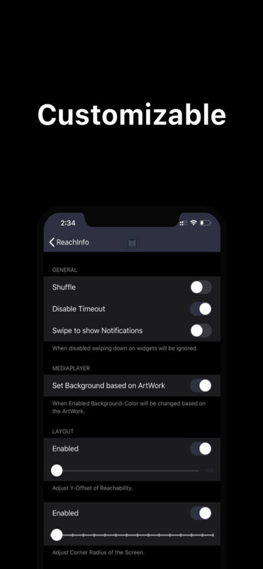
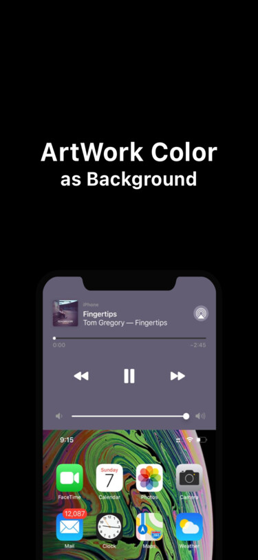

## ReachInfo
Reachability modernized.

## Compiling
  - [Theos](https://theos.dev/) is required to compile the project
  - Depends on [libPDDokdo](https://github.com/s8ngyu/libpddokdo) and [libcephei](https://github.com/hbang/libcephei)

---
### @me
[~~Twitter~~ X](http://x.com/1di4r)
